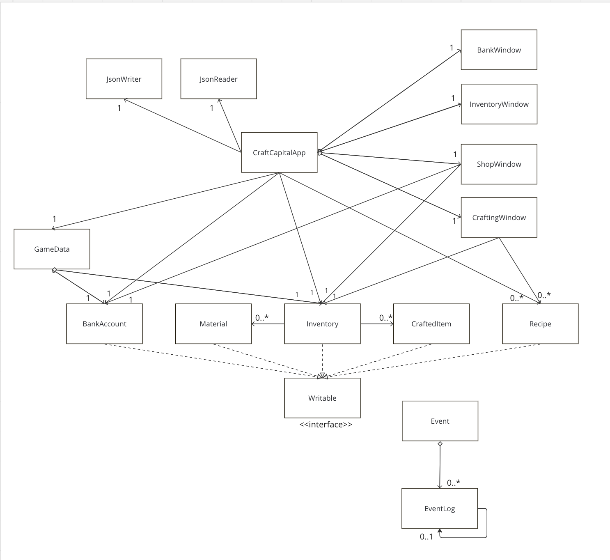

# My Personal Project: Craft Capital

DEMO: https://www.youtube.com/watch?v=tdAM_a6lvgM&t=3s

## Overview

**Craft Capital** is a strategy and simulation game that involves elements
of crafting, buying, selling, and financial management. In this game:
- Player's will start each "day" with a random set of crafting materials
- Player's craft items with said materials based on available recipes
- Each crafted item occupies space in a limited inventory
- Items are automatically sold at the end of the day, earning varying amounts of money
- Money in the player's bank account accumulate daily interest, simulating a banks saving account
- Buy materials and expand inventory capacity!
- Be careful decisions on what items to craft, balancing material usage, inventory space, and potential earnings
- *The goal?* Become a millionaire in the least amount of days!

This game will interest those who enjoy strategy and resource management simulations.
Users will increase financial literacy and use their problem-solving skills to get as rich as quickly as possible.
Inspired by classic tower defense games, I wanted to create a some-what realistic simulation that involves money and 
business to stimulate users brains. This project can be endlessly expanded upon and refined, which can provide me 
excellent pathways for continued learning and development.

## User Stories
- As a user, I want to be able to craft items based on given recipes and materials and add it the inventory
- As a user, I want to be able to check the list of crafted items in the inventory
- As a user, I want to be able to reorder to my crafted items to see in descending order for price.
- As a user, I want to be able to buy new materials and inventory capacity
- As a user, I want to be able to move onto the next day and see what day I'm on 
and the amount of money I made from selling crafted items
- As a user, I want to be able to check my bank account
- As a user,  I want to be able to save my entire game state with inventory, bank account, and daily progress
- As a user, I want to be able to load my last saved state 

## Instructions for Grader
- You can generate the first required action related to the user story "adding multiple Xs to a Y" by
crafting items in the craft menu to add items to the inventory (If you have insufficient materials, then click next day
or buy them in the shop). Alternatively, the "Next Day" button will clear all items which are sold for money.
- You can generate the second required action related to the user story "adding multiple Xs to a Y" by
going into the inventory and clicking the "Sort by Descending Price" button to reorder the items as stated.
- You can locate my visual component by beating the game, which shows a special win image. You beat the game by
reaching a $100 in the bank account, this can be fast-tracked by selling at least one item and repeatedly
clicking "Next Day" to generate money from interest.
- You can save the state of my application by clicking the "Save" button at the main menu.
- You can reload the state of my application by licking the "Load" button at the main menu.

## Phase 4: Task 2
```
Sat Mar 30 16:39:35 PDT 2024
Added new item: 'Live, Laugh, Love' Wooden Block
Sat Mar 30 16:39:35 PDT 2024
Added new item: 'Live, Laugh, Love' Wooden Block
Sat Mar 30 16:39:39 PDT 2024
Cleared inventory by going to the next day
Sat Mar 30 16:39:40 PDT 2024
Cleared inventory by going to the next day
Sat Mar 30 16:39:40 PDT 2024
Cleared inventory by going to the next day
Sat Mar 30 16:39:44 PDT 2024
Added new item: 'Live, Laugh, Love' Wooden Block
Sat Mar 30 16:39:45 PDT 2024
Added new item: Iron Spatula
Sat Mar 30 16:39:46 PDT 2024
Added new item: Iron Spatula
Sat Mar 30 16:39:46 PDT 2024
Added new item: Iron Spatula
Sat Mar 30 16:39:47 PDT 2024
Capacity overload, failed to add new item: Iron Spatula
Sat Mar 30 16:39:51 PDT 2024
Sorted items in inventory by price descending
Sat Mar 30 16:39:55 PDT 2024
Cleared inventory by going to the next day
```
## Phase 4: Task 3


In terms of cohesion, the model classes are sufficiently highly cohesive,
however, despite having created more windows for the UI, CraftCapitalApp is has low cohesion.
A similar rhetoric could be said about coupling; on its own, the UI package has relatively low coupling.
However, CraftCapitalApp is highly dependent on essentially every component of the project. Overall, the structure
is more web-like than tree-like due to all the associations, however there are no bi-directional-relationships.
There are no abstract classes and only one interface due to saving the project. To improve my project,
I can reduce a significant amount of duplication in the UI classes with the addition of more abstract classes.
For example, creating the window with the same font, background colour, etc. would only need to be done once.
I also hard-coded many fields and values, especially for game-balancing and UI positioning; refactoring my code can 
make changing these values much easier and more visually appealing for the GUI.
